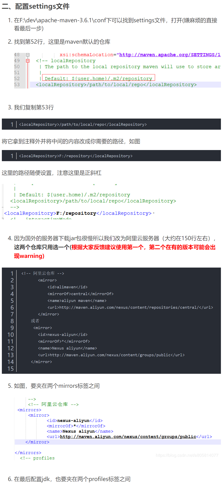

# 什么是maven?

```
	maven是基于项目对象模型(POM project object model)，可以通过一小段描述信息（配置）来管理项目的构建，报告和文档的软件项目管理工具[百度百科]
　　　这种又是大白话，如果没明白maven是什么，那么上面这句话跟没说一样，我自己觉得，Maven的核心功能便是合理叙述项目间的依赖关系，通俗点讲，就是通过pom.xml文件的配置获取jar包，而不用手动去添加jar包，而这里pom.xml文件对于学了一点maven的人来说，就有些熟悉了，怎么通过pom.xml的配置就可以获取到jar包呢？pom.xml配置文件从何而来？等等类似问题我们需要搞清楚，如果需要使用pom.xml来获取jar包，那么首先该项目就必须为maven项目，maven项目可以这样去想，就是在java项目和web项目的上面包裹了一层maven，本质上java项目还是java项目，web项目还是web项目，但是包裹了maven之后，就可以使用maven提供的一些功能了(通过pom.xml添加jar包)。
```

# maven环境变量配置




### 文件

```
我们复制第53行

<localRepository>/path/to/local/repo</localRepository>

将它拿到注释外并将中间的内容改成你需要的路径

<localRepository>F:/repository</localRepository>
```


```
<!-- 阿里云仓库 -->
        <mirror>
            <id>alimaven</id>
            <mirrorOf>central</mirrorOf>
            <name>aliyun maven</name>
            <url>http://maven.aliyun.com/nexus/content/repositories/central/</url>
        </mirror>
```

